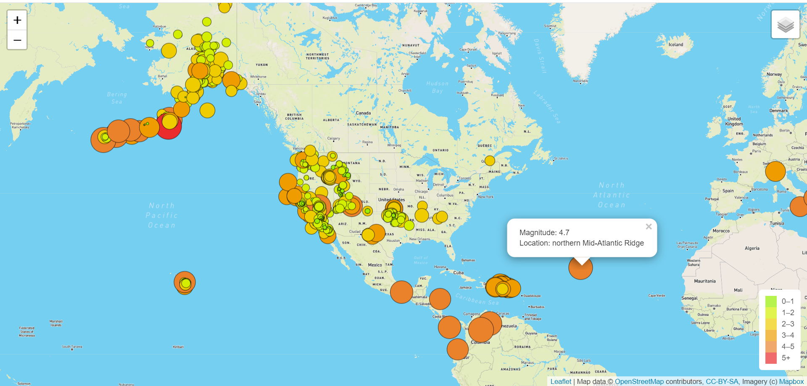
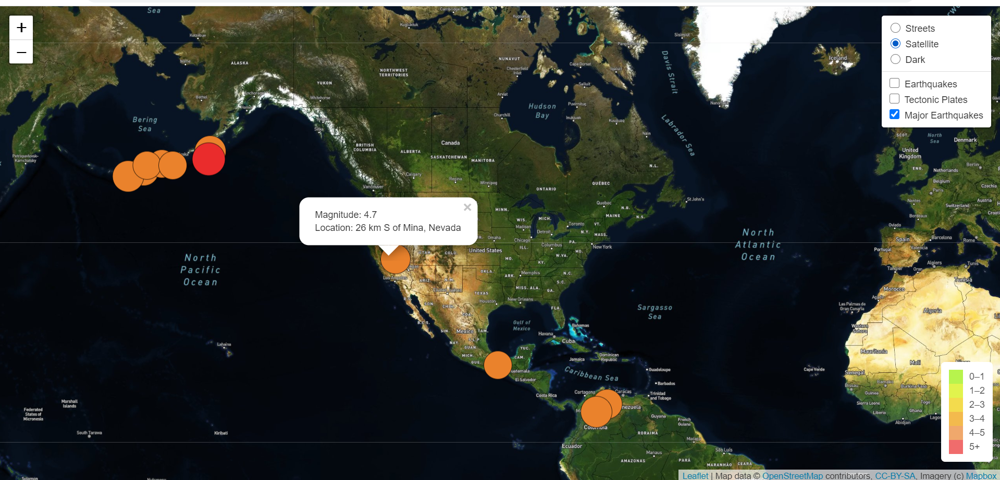

# Background

The purpose of this project is to visually show the differences between the magnitudes of earthquakes all over the world for the last seven days. To complete the project, we have used the URL for GeoJSON earthquake data from the USGS website to retrieve geographical coordinates and the magnitudes of earthquakes for the last seven days and add them to the map.

We had obtained all the earthquakes which happened for the period as captured in the map below.

- AllEarthQuakes map around the world

You will notice the streets mode map selected prior adding the other two maps with their layers.

## Results

We parse the major earthquakes for the past 7days and added a satellite layer.

- MajorEQ on streets mode

The control layer is workign correclty and the popup for major earthquakes is displayed as well. We also included the satellite layer instead of streets.

- Tectonic map

The tectonic plate used the USGS available data. Please see above the thick red line in the street map going through all the continents with major impact on the southern hemisphere.

- Dark Map displaying all layers

- All layers map satellite mode

## Conclusion

The coordinates and magnitudes of the earthquakes were successfully retrieved from the GeoJSON data. We used the leaflet library to plot the data on a Mapbox map through an API request and create interactivity for the earthquake data.
